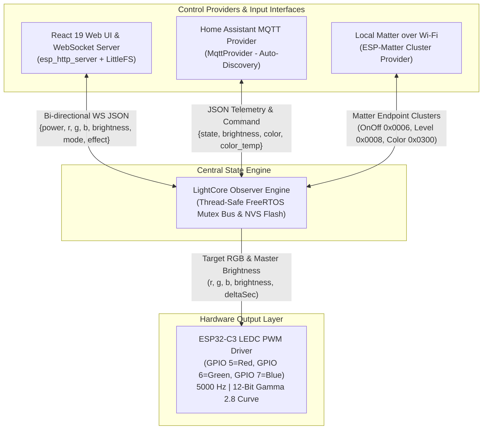

# ADR-001: Multiplexed Modular Control Plane Architecture

- **Status**: Accepted
- **Date**: 2026-08-02
- **Deciders**: Engineering & User
- **Technical Context**: ESP32-C3 Super Mini 3-channel PWM LED Driver (`rgb-node`)

---

## 1. Context and Problem Statement

The `rgb-node` project features a high-performance 12-bit PWM LED driver running at 5000 Hz, a 100 Hz exponential low-pass smoothing engine, 12-bit perceptual Gamma 2.8 curve correction, INMP441 I2S audio DSP music sync, and a custom React 19 web application served via LittleFS and WebSockets.

As the project expands to support smart home ecosystems—specifically **Home Assistant** (via MQTT Auto-Discovery) and **Google Home / Apple Home** (via local Matter over Wi-Fi)—we require an architecture that allows exploring and executing multiple protocol backends without sacrificing, breaking, or replacing the existing React Web UI or core rendering engine.

---

## 2. Decision Outcome

We decision to implement a **Multiplexed Modular Control Plane Architecture** centered around a unified, thread-safe State Bus (`LightCore`).

### Key Decisions:
1. **Zero-Compromise Interface Preservation**: The working React Web UI, WebSockets server, REST API, Gamma curve, and Audio DSP engine are preserved as the primary control interface, backed natively by ESP-IDF's `esp_http_server` and `esp_littlefs`.
2. **Unified State Bus (`LightCore`)**: A central C++ observer engine acts as the single source of truth for device state (`power`, `brightness`, `mode`, `colorTemp`, `warmth`, `r`, `g`, `b`, `effect`, `speed`, `musicSensitivity`).
3. **Decoupled Control Providers**: All input sources (Web UI, WebSockets, REST API, MQTT Auto-Discovery, Matter Clusters) implement a unified `ControlProvider` C++ interface.
4. **Bi-Directional State Synchronization**: When any controller (e.g. Google Home via Matter or Home Assistant via MQTT) mutates light state, `LightCore` updates target outputs, persists state to ESP32 NVS via `nvs_flash`, and broadcasts live state updates to all active listeners (so the Web UI color wheel and sliders update live over WebSockets).
5. **PlatformIO Environment Multiplexing**: Modular build targets defined in `platformio.ini` (`esp32c3-web`, `esp32c3-mqtt`, `esp32c3-matter`) allow building lightweight single-protocol binaries or full-stack multiplexed binaries without unnecessary memory overhead.

---

## 3. Architecture Diagram

---

## 4. Consequences

### Positive:
- **Zero Loss of Functionality**: The custom React Web UI and rich feature set remain 100% active.
- **Simultaneous Control**: Adjusting color in Google Home, Home Assistant, or Web UI updates all connected clients instantaneously.
- **Clean Separation of Concerns**: Hardware PWM driving (`driver/ledc.h`) and DSP audio processing (`driver/i2s_std.h`) are decoupled from network protocol handlers.
- **Elimination of Framework Bloat**: Pure ESP-IDF migration saves ~350KB flash overhead and optimizes RAM utilization.

### Negative / Risks:
- **Flash Footprint**: Statically linking Matter (`libCHIP.a`) requires repartitioning 4MB flash memory (`1.625MB app0`, `1.625MB app1`).
- **Framework Migration**: Requires transitioning PlatformIO build configuration to native ESP-IDF framework (`framework = espidf`).
